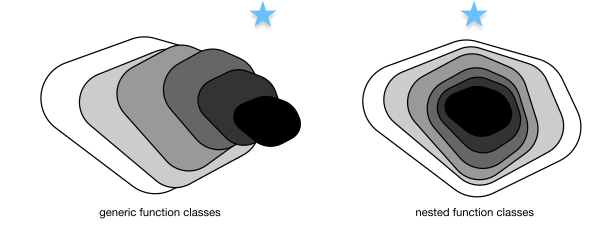
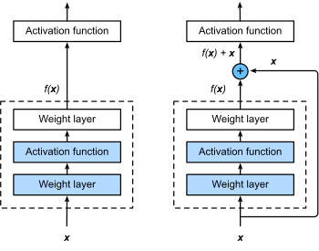
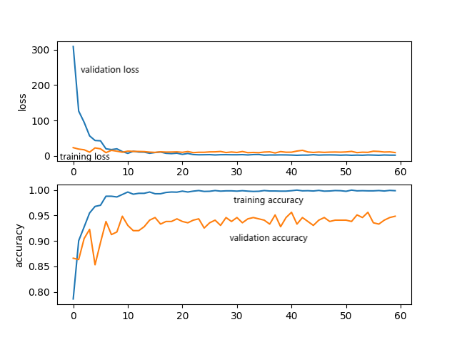

# Flower Classification

## Method

Deep residual networks(ResNets) are state-of-the-art methods in the field of image classification. Pytorch provides several resnet models pre-trained on ImageNet, out of which we selected the deepest resnet152 for this task.

ResNet's architecture ensures that every additional layer contains an identity mapping $f(\mathbf{x}) = \mathbf{x}$. The more layers we have, the more freedom we have to reduce training errors. ResNet enables more layers while avoiding the pitfall of overfitting. In most cases, the accuracy should increase strictly with network depth. Hence, we can expect resnet152 to be our ace.  For this architecture, we also do not need to add our own layer to gild the lily.




## Code

```
.
├── README.md
├── checkpoints
│   └── best_resnet.pth
├── config.py
├── data
│   ├── test
│   ├── train
│   └── valid
├── dataset.py
├── main.py
├── model.py
```

dataset.py defines custom dataset class, with a helper function load_data that returns image_datasets, data_loaders, and data_size. image_datasets is a dictionary mapping each category into according image folder (torchvision.datasets.ImageFolder api). data_loaders is similar.

config.py defines ModelConfig class that wraps all parameters.

model.py defines ModelCNN class wrapping a helper function train_valid. The optimizer is SGD. In training, a multistep learning rate scheduler is applied. At first we used a small learning rate without decay, yielding validation error curves that were quite unpromising. After searching for official documents, we found pytorch's optim.lr_scheduler.MultiStepLR, which worked great.

main.py contains a helper function that does everything required, given the pretrained model. 

## Result



The validation accuracy keeps an increasing trend, so overfitting is unlikely.

## Reference

1. [ Deep Residual Learning for Image Recognition](https://arxiv.org/abs/1512.03385)

2. [ResNet Introduction](https://d2l.ai/chapter_convolutional-modern/resnet.html)

3. [How to Adjust Learning Rate](https://pytorch.org/docs/stable/optim.html#how-to-adjust-learning-rate)

4. [Training a Classifier](https://pytorch.org/tutorials/beginner/blitz/cifar10_tutorial.html)
